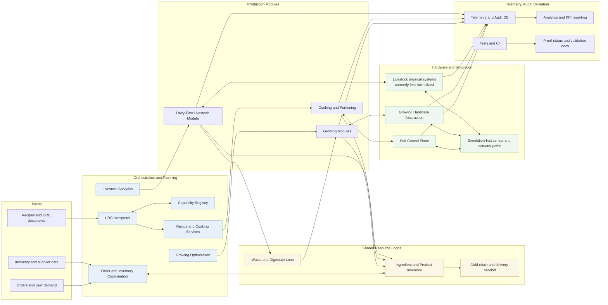

## Architecture Overview

This is the current system map for the software-first prototype.

It shows the full shape the repo is trying to support now:

- growing modules
- cooking and portioning
- dairy-first livestock module
- shared resource loops
- telemetry and audit
- distribution boundary points

It does not claim that all physical subsystems are equally mature. Some parts are implemented in software, some are simulated, and some are still design-stage.

## How To Read This

### What is implemented now

- backend APIs and models for recipes, cooking, growing, and livestock
- optimization and analytics services
- telemetry-oriented architecture direction
- simulation-first execution framing

### What is only partially parallel today

- growing modules have a more mature hardware-control path than livestock
- livestock now has an explicit abstraction and simulation layer, but physical drivers and external validation are still less mature than on the growing side
- distribution is represented as a boundary and integration point, not a full implementation inside this repo

### What this diagram is meant to prevent

- a README that sounds broader than the system map
- a dairy-first livestock story that sounds more mature than the current proof surface
- confusion about what belongs in this repo versus what lives at a boundary such as distribution

## Notes

- Use the companion `docs/architecture.svg` if you need a static export for presentations.
- If Mermaid does not render in your editor, open the file in VS Code Markdown preview.
- For the current proof vocabulary, see `docs/CURRENT_PROOF_STATUS.md`.
