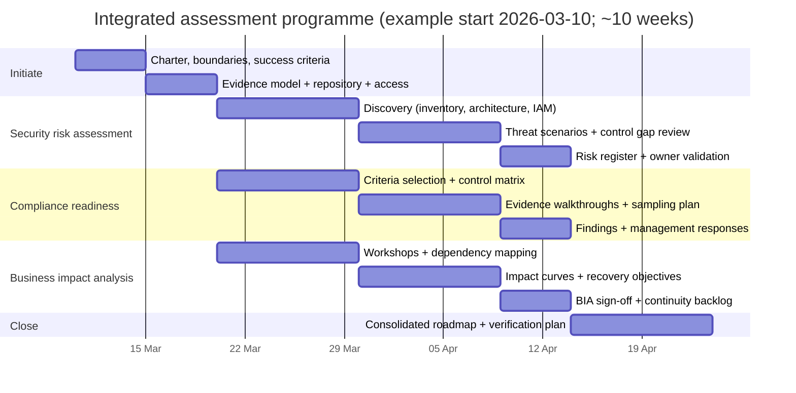
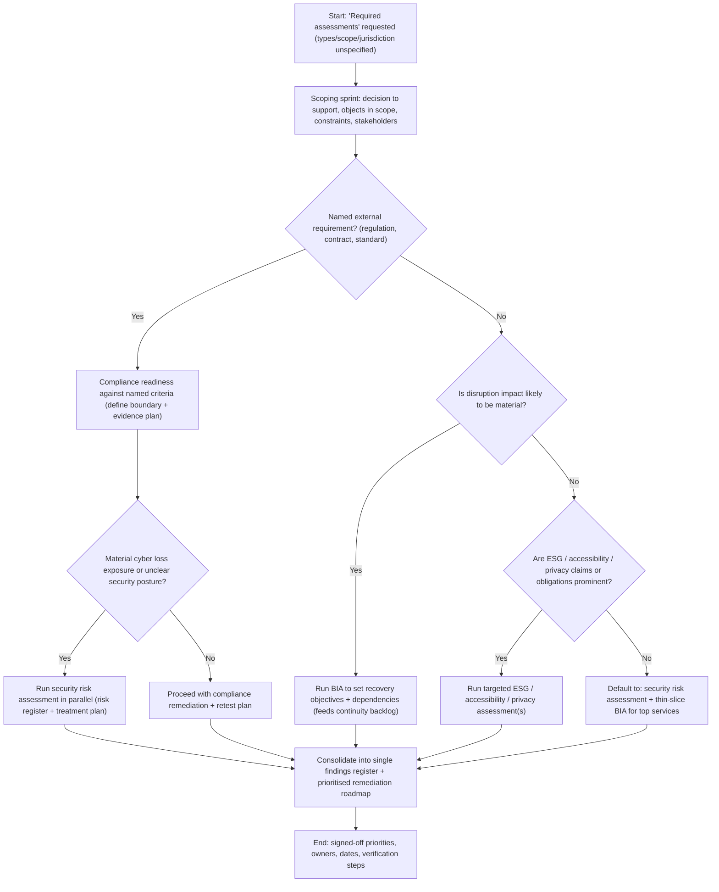

# Update: Executing Unspecified “Required Assessments”

Status: Preserved imported research export

Interpretation

- Keep this file as a raw source artifact.
- Use [external_review_packet/received_reports/2026-03-10_report_03_intake.md](external_review_packet/received_reports/2026-03-10_report_03_intake.md) for the normalized operational reading.

```text

## Executive summary

This update tightens the prior draft into a more decision-oriented, execution-ready assessment playbook for cases where **assessment types, industry, jurisdiction, scope, budget, and timeline are unspecified** (all remain unspecified here). The revised structure centres on three default assessments—**security risk assessment, compliance audit/readiness, and business impact analysis (BIA)**—because they map to broadly applicable organisational needs: managing cyber risk outcomes, demonstrating conformance to explicit requirements, and defining continuity requirements (recovery objectives and dependencies). citeturn0search4turn0search9turn1search1turn0search3

The update standardises deliverables around a single **Findings Register schema** (shared fields, severity logic, owners, due dates, and verification steps) so outputs from different assessment types can be consolidated into a single remediation roadmap rather than separate, hard-to-compare reports. This aligns with risk management guidance emphasising context, communication, and ongoing monitoring rather than one-off checklists. citeturn1search0turn0search9

Primary/official sources are prioritised and refreshed: **CSF 2.0** for outcome-oriented cybersecurity framing; **SP 800-30 Rev.1** for risk assessment mechanics; **ISO 31000** for enterprise risk principles; **ISO 22301 / ISO/TS 22317** for continuity and BIA; **ISO 19011** (plus the ISO/FDIS update signal) for audit programme guidance; **AICPA Trust Services Criteria** for SOC 2-aligned controls; **PCI DSS v4.0.1** for payment security requirements; **W3C WCAG 2.2** for accessibility; **GHG Protocol Corporate Standard** and **IFRS S1/S2 / GRI Universal Standards** for sustainability disclosure readiness; and **ENISA** for EU risk management standards overviews and interoperability references. citeturn0search0turn0search1turn1search0turn1search1turn0search3turn2search0turn2search8turn2search1turn2search2turn2search6turn2search7turn3search0turn3search1turn3search2turn3search7turn4search1turn4search0

## Delta from the prior draft

| Change type | What changed (explicit) | Outcome for the user |
|---|---|---|
| Edit (structure) | Consolidated into a repeatable pattern: **Catalogue → Decision matrix → Default trio execution plans → Sources/tools → Programme visuals → Adaptation notes** | Faster navigation; fewer “one-off” sections |
| Edit (catalogue) | Reduced the assessment catalogue to **8 types** and tightened each entry (purpose, scope, frameworks, evidence, methods, deliverables, effort, stakeholders) | Less noise; easier selection under ambiguity |
| Clarification | Distinguished **compliance audit vs readiness**: readiness = internal gap assessment + evidence pack design; audit = independent/attestation context | Prevents “paper compliance” misunderstandings |
| Clarification | Made “effort” explicit as **Low/Med/High bands** tied to scope breadth + evidence maturity | More realistic planning when budget/timeline are unspecified |
| Addition | Introduced a single **standardised Findings Register template** used across all assessment types | Enables one consolidated remediation roadmap |
| Addition | Added **decision triggers** tied to: regulatory exposure, procurement demands, disruption criticality, and data availability | Higher-quality “what to run first” decisions |
| Update | Refreshed key source status points: **CSF 2.0 (Feb 2024)**, **PCI DSS v4.0.1 (Jun 2024; no new requirements)**, **WCAG 2.2 (Rec Oct 2023; update Dec 2024)** | Reduces reliance on stale editions citeturn0search0turn2search2turn2search7 |
| Addition | Added tool suggestions **categorised by function** (evidence management, scanning, audit, continuity) rather than brand-led lists | Easier to map to your stack without overspecifying |

## Tightened comparative catalogue of plausible assessment types

The catalogue below retains only the most common “required assessment” interpretations in modern delivery and assurance contexts, and keeps each entry decision-useful.

| Assessment type | Purpose | Typical scope | Key frameworks / standards (primary) | Data / evidence required | Methods | Deliverables | Effort | Stakeholders |
|---|---|---|---|---|---|---|---|---|
| Security risk assessment | Identify and prioritise cybersecurity risks and treatments | Systems/services, identities, data flows, suppliers | CSF 2.0 outcomes; SP 800-30 risk assessment; ISO 31000 principles; ISO/IEC 27005 guidance | Asset/service inventory, architecture diagrams, IAM model, vulnerability inputs, incident history | Threat scenario analysis; control gap review; likelihood/impact scoring | Risk register; risk treatment plan; target state roadmap | Med–High | Exec sponsor, security, engineering/SRE, IT, legal/privacy, procurement citeturn0search4turn0search9turn1search0turn1search3 |
| Compliance audit / readiness | Determine conformance to explicit requirements; build audit-ready evidence trail | Defined boundary (entity/product/environment) and control set | ISO 19011 audit guidance; ISO/IEC 27001 (ISMS); AICPA TSC (SOC 2); PCI DSS (if payments) | Policies, procedures, tickets/logs, access reviews, training records, vendor evidence | Requirements mapping; walkthroughs; sampling; design vs operating effectiveness tests | Gap register; evidence pack (“audit binder”); management action plan; retest criteria | Med–High | Compliance, internal audit, control owners, security/IT, vendors citeturn2search0turn0search2turn2search1turn2search2turn2search10 |
| Business impact analysis | Quantify disruption impacts; set recovery objectives and dependencies | Critical processes/services + upstream/downstream dependencies | ISO 22301 (BCMS); ISO/TS 22317 (BIA guidelines); ISO 31000 principles | Process inventory, dependency maps, outage history, recovery capabilities | Facilitated workshops; impact-over-time curves; tiering; feasibility checks | BIA register; critical services list; recovery targets; continuity backlog | Medium | Ops leadership, process owners, IT/service owners, finance/risk citeturn1search1turn0search3turn1search0 |
| Privacy impact assessment (DPIA-style) | Identify privacy risks to individuals and controls needed | Processing activities, data flows, vendors, retention, rights handling | ISO/IEC 27001 risk actions context; (jurisdiction-specific DPIA regimes are unspecified) | Data inventory, processing records, vendor DPAs, security measures | Data-flow mapping; necessity/proportionality checks; privacy risk evaluation | DPIA report(s); privacy risk controls backlog; consult triggers | Low–Med | Privacy/legal, security, product, data owners citeturn0search2turn1search3 |
| Accessibility & usability audit | Reduce exclusion and legal/reputational risk; improve UX | Websites/apps; core journeys; support flows | WCAG 2.2 (W3C Recommendation); (procurement standards vary by jurisdiction—unspecified) | UI inventory, journeys, test results (automated + manual), design system | Automated scanning + manual checks; assistive tech testing; heuristic review | Conformance/issue report; prioritised backlog; remediation guidance | Low–Med | Product, design, engineering, QA, legal citeturn2search3turn2search7turn2search15 |
| Performance benchmarking | Validate capacity, responsiveness and stability vs expectations | APIs/services, infra components, critical flows | Quality models as internal benchmarks; requirements/SLOs (unspecified) | Monitoring baselines, load profiles, architecture, bottleneck evidence | Load/stress tests; profiling; capacity modelling | Benchmark results; bottleneck list; tuning backlog; SLO recommendations | Low–Med | SRE/platform, engineering, product, ops |
| Technical due diligence | Reduce technical uncertainty for investment/procurement/scale decisions | Architecture, SDLC, reliability, security posture, maintainability | Control and risk references (CSF/27001/27002) applied to engineering reality | Repos, CI/CD evidence, incident history, architecture docs, observability | Code/architecture sampling; maturity scoring; dependency review | Due diligence report; critical risks; “fix-first” roadmap | Med–High | CTO/engineering, product, security, investors/procurement citeturn0search4turn0search2turn1search2 |
| ESG / sustainability disclosure readiness | Validate metrics, controls, and reporting readiness | Governance, data controls, emissions inventory, reporting scope | GHG Protocol Corporate Standard; IFRS S1/S2; GRI Universal Standards | Activity data, calculation methods, governance evidence, change logs | Metric computation + controls; assurance-style sampling | Baseline inventory; controls gaps; disclosure-ready draft pack | Med–High | Finance, sustainability, ops, procurement, legal citeturn3search0turn3search1turn3search2turn3search7turn3search3 |

## Improved decision matrix for selecting assessments

Use this matrix when requirements are unclear. It maps common drivers and constraints to an assessment “bundle” rather than a single choice.

| Input factor (unspecified unless you set it) | Indicators | Recommended assessment(s) | Notes / sequencing |
|---|---|---|---|
| Objective | Procurement/customer assurance pressure | Compliance readiness + Security risk assessment | Readiness builds the evidence trail; risk work prevents “checkbox-only” security. citeturn2search1turn0search9 |
| Objective | Reduce cyber loss exposure / unknown security posture | Security risk assessment (+ targeted technical due diligence as needed) | Use CSF 2.0 outcomes to frame gaps; SP 800-30 for scoring mechanics. citeturn0search4turn0search9 |
| Objective | Resilience / continuity / outage impact is material | BIA first, then Security risk (for incident-driven disruption) | ISO/TS 22317 drives recovery targets and dependencies; security then targets disruption vectors. citeturn0search3turn1search1 |
| Risk profile | Heavy third-party/vendor reliance | Security risk + Compliance readiness (+ ESG if supply-chain claims matter) | Include supplier evidence and contractual controls early. citeturn0search4turn2search0turn3search0 |
| Regulatory exposure | Payment card data present | PCI DSS readiness + Security risk + BIA | PCI DSS v4.0.1 is a clarification update (no new requirements) but still changes interpretation details. citeturn2search2turn2search6turn2search10 |
| Regulatory exposure | Public accessibility obligations plausible | Accessibility audit (+ Compliance mapping if procurement requires) | WCAG 2.2 is current; note ongoing updates/errata. citeturn2search7turn2search3 |
| Budget | Constrained | “Thin-slice” Security risk + BIA for top 3–5 services | Focus on highest-impact services; defer broad audit testing until scope is explicit. citeturn1search0turn0search9 |
| Timeline | Short (≤6 weeks) | Rapid readiness gap assessment + BIA workshops + security triage | Prioritise discovery + evidence pack design; avoid multi-month control operating-effectiveness claims. citeturn2search0turn0search9 |
| Data availability | Low documentation / weak inventories | Start with discovery: asset/process inventory + interviews; then pick compliance target | ISO 31000 and SP 800-30 both assume context-setting and communication as first-class steps. citeturn1search0turn0search9 |
| Data availability | Strong logs/tickets/telemetry | Deeper testing: operating effectiveness sampling + performance benchmarking | High evidence maturity supports faster, more defensible conclusions. citeturn2search0turn0search9 |

## Revised execution plans for the prioritised default trio

### Shared execution backbone and standardised findings template

Across all three assessments, use the same backbone:

1) Charter and boundaries → 2) Evidence model and repository → 3) Fieldwork → 4) Analysis and scoring → 5) Findings validation with owners → 6) Remediation roadmap + verification plan. This matches risk guidance that treats preparation and communication as core steps, not add-ons. citeturn0search9turn1search0

**Standard Findings Register (use for all assessment types).**

| Field | Definition (tight) |
|---|---|
| Finding ID | Unique, stable identifier |
| Assessment type | Security / Compliance / BIA (or other) |
| Scope object | Process/service/system/vendor |
| Criteria reference | Requirement or outcome (e.g., CSF outcome / ISO clause / PCI requirement) |
| Condition | What is observed (factual) |
| Evidence | Artefact references + dates (logs, screenshots, tickets, interview notes) |
| Impact | Operational, financial, legal/regulatory, safety, reputation (as applicable) |
| Severity | High/Med/Low (define once; apply consistently) |
| Recommendation | Specific corrective/preventive action |
| Owner | Accountable person/team |
| Target date | Agreed completion date |
| Verification | What proves closure (retest steps / evidence) |

### Security risk assessment

**Data-collection checklist (minimum viable, evidence-first).**

| Domain | Collect (examples) |
|---|---|
| Context & risk tolerance | Critical services, “crown jewels”, tolerance statements aligned to organisational risk principles citeturn1search0 |
| Inventory & architecture | Service list, data classifications, trust boundaries, key integrations citeturn0search4 |
| Identity & access | MFA coverage, privileged roles, access review cadence, joiner/mover/leaver workflow |
| Exposure & vulnerabilities | Scan outputs, patch SLAs, external attack surface, dependency risk notes |
| Detection/response | Logging coverage, alert routes, IR runbooks, incident summaries aligned to CSF detect/respond/recover outcomes citeturn0search4 |
| Suppliers | Critical vendors, data sharing, security clauses, breach notification paths |

**Analysis methods (practical rigour).**  
Frame gaps using CSF 2.0 outcomes (what must be achieved) and build risk statements using the SP 800-30 structure (threat events, vulnerabilities/predisposing conditions, likelihood, impact). citeturn0search4turn0search9

**Risk statement pattern (use in Findings Register).**  
“If **[threat event]** exploits **[condition]**, then **[impact]** may occur affecting **[scope object]**; current controls are **[summary]**; residual risk is **[rating]**.” citeturn0search9

**Remediation prioritisation (security).**  
Prioritise by: (1) intolerable impact vs stated tolerance (ISO 31000), (2) exploitability and reachability, (3) blast radius (shared identity/platform controls outrank single-service issues), (4) time-to-risk-reduction (containment now vs uplift vs redesign). citeturn1search0turn0search9

**Sample timeline and resourcing (8 weeks; adjust if scope expands).**

| Weeks | Outputs | Typical resourcing |
|---|---|---|
| 1 | Charter, scoring model, evidence repo | 1 lead (0.8–1.0 FTE), security SME (0.3), platform/arch SME (0.2) |
| 2–3 | Inventory + top threat scenarios | lead + security analyst (0.5) + service owners (interviews) |
| 4–5 | Control review + targeted validation | lead + SMEs; optional tester time (0.2–0.4) |
| 6 | Scoring + draft register | lead + security |
| 7 | Owner validation workshop | owners + sponsor |
| 8 | Final register + treatment plan | lead |

### Compliance audit / readiness

**Clarify target (still unspecified).**  
If the compliance target is unspecified, run “readiness” as a **requirements discovery** and select a target (e.g., ISO/IEC 27001-style ISMS, SOC 2 via AICPA TSC, PCI DSS if payments) only after confirming: customer demand, data types, and contractual obligations. citeturn0search2turn2search1turn2search6

**Data-collection checklist (evidence pack design).**

| Control area | Evidence examples |
|---|---|
| Governance | Policy set, roles/ownership, risk register, management review records (if present) citeturn0search2 |
| Access management | Access reviews, MFA configs, privileged access approvals |
| Change management | Change tickets, approvals, CI/CD logs, peer review evidence |
| Operations | Monitoring dashboards, incident tickets, postmortems |
| Vendor management | Due diligence records, contracts, security addenda, subprocessor lists |
| Training | Mandatory training completion evidence |
| Physical (if in scope) | Visitor logs, device handling procedures |

**Audit approach.**  
Apply ISO 19011 principles for programme structure (planning, competence, evidence handling), then test controls as: (a) design adequacy, (b) operating effectiveness (where a time period is required). citeturn2search0turn2search8

**Compliance-specific finding wording (tight).**  
“Requirement **[ref]** is **[met / partially met / not met]** because **[condition]**; evidence **[refs]**; impact **[impact]**; recommended action **[action]**; closure requires **[verification]**.”

**Remediation prioritisation (compliance).**  
Sequence by: (1) “pass/fail” requirements, (2) controls that unblock evidence generation for multiple requirements (e.g., access review cadence, change approval records), (3) highest-risk gaps revealed by the parallel security assessment. citeturn2search1turn0search9

**Sample timeline and resourcing (10 weeks readiness).**

| Weeks | Outputs | Typical resourcing |
|---|---|---|
| 1–2 | Criteria selection, boundary definition, control matrix | 1 lead (0.8–1.0), compliance SME (0.3), control owners |
| 3–5 | Evidence collection + walkthroughs | lead + owners (time-boxed) |
| 6–7 | Sampling/testing + consistency checks | lead + internal audit/security SME |
| 8 | Findings + management responses | sponsor + owners |
| 9–10 | Audit-ready pack + retest plan | lead |

**PCI DSS note (if applicable; currently unspecified).**  
If payment card data is in scope, PCI DSS v4.0.1 is a limited revision clarifying intent (no new/deleted requirements) and should be used as the reference version for readiness work. citeturn2search2turn2search6turn2search10

### Business impact analysis

**Data-collection checklist (BIA essentials).**

| BIA input | Capture |
|---|---|
| Process/service catalogue | Names, owners, customers, operational hours |
| Dependency map | Systems, vendors, facilities, key roles |
| Impact categories | Financial, legal/regulatory, safety, customer harm, reputation |
| Impact over time | Impacts at 2h/8h/24h/72h/1w (choose the grid) |
| Current recovery capability | Backups, failover, manual workarounds, staffing constraints |
| Recovery objectives | Target recovery time and data recovery (terminology may vary) |

ISO/TS 22317 is explicit that BIA should be formal and documented, tailored to organisational needs, and not a uniform prescribed process. citeturn0search3turn0search7

**Analysis methods.**  
Use structured workshops to build time-based impact curves and tier services/processes; validate proposed objectives against feasibility with IT/service owners; then produce a continuity backlog aligned to ISO 22301 BCMS expectations (requirements to prepare for, respond to, and recover from disruption). citeturn1search1turn0search3

**BIA finding style (requirements-focused).**  
“Service/process **[X]** is Tier **[n]**; unacceptable impact begins at **[time]**; required recovery objective is **[target]**; current capability is **[current]**; gap is **[gap]**; recommended continuity actions are **[actions]**.”

**Prioritisation (resilience backlog).**  
Rank by time-to-unacceptable-impact, then by cross-service dependencies (single points of failure), then by feasibility and leverage (actions that elevate multiple critical services). citeturn1search1turn0search3

**Sample timeline and resourcing (6–8 weeks).**

| Weeks | Outputs | Typical resourcing |
|---|---|---|
| 1 | Taxonomy, templates, workshop plan | BCM/BIA lead (0.8–1.0), ops sponsor |
| 2–4 | Workshops + dependency mapping | lead + process owners + IT owners |
| 5 | Consolidation + feasibility alignment | lead + architects/SRE |
| 6 | Sign-off of targets + backlog | sponsor + owners |
| 7–8 (optional) | Test plan + exercise schedule | lead + ops/security |

## Updated primary/official sources to prioritise and suggested tools

### Prioritised primary/official sources

- entity["organization","NIST","us standards agency"]: CSF 2.0 and SP 800-30 Rev.1 as core cybersecurity outcome and risk assessment references. citeturn0search4turn0search9  
- entity["organization","ISO","international standards body"]: ISO 31000 for risk principles; ISO/IEC 27001 and ISO/IEC 27005 for information security risk and ISMS context; ISO 22301 and ISO/TS 22317 for continuity and BIA; ISO 19011 for audit guidance (note ISO/FDIS progression). citeturn1search0turn0search2turn1search3turn1search1turn0search3turn2search0turn2search8  
- entity["organization","AICPA","us accountancy body"]: Trust Services Criteria (SOC 2 control criteria baseline). citeturn2search1turn2search5  
- entity["organization","PCI Security Standards Council","payment card standards body"]: PCI DSS v4.0.1 standard and supporting documents. citeturn2search6turn2search2  
- entity["organization","W3C","web standards body"]: WCAG 2.2 and its update/errata notes. citeturn2search3turn2search7turn2search15  
- entity["organization","GHG Protocol","ghg accounting standards"]: Corporate Standard for emissions inventory requirements/guidance. citeturn3search0turn3search8  
- entity["organization","IFRS Foundation","ifrs sustainability standards"]: IFRS S1 and IFRS S2 effective dates and disclosure objectives. citeturn3search1turn3search2  
- entity["organization","Global Reporting Initiative","sustainability reporting standards"]: Universal Standards publication/effective dates and reporting structure. citeturn3search7turn3search3  
- entity["organization","ENISA","eu cybersecurity agency"]: risk management standards overview and interoperability references for RM frameworks. citeturn4search1turn4search0  

### Suggested tools (categorised by function)

| Category | What you need tools to do | Examples of tool types |
|---|---|---|
| Evidence management | Immutable-ish evidence capture, access control, retention, exportable packs | Document repositories with audit trails; evidence request tracking |
| Asset & service inventory | Baseline what exists and what matters | CMDB/service catalogue; cloud inventory; dependency mapping |
| Security validation | Produce defensible exposure inputs | Vulnerability scanning; cloud security posture; IAM review; log/SIEM access |
| Audit/readiness management | Control matrix, sampling plans, retest workflows | GRC/audit platforms; automated control monitoring |
| BIA & continuity | Workshop capture, dependency mapping, exercise scheduling | Continuity planning tools; tabletop/exercise trackers |
| ESG reporting readiness | Data lineage and methodology change control | ESG data platforms; emissions calculation workbooks with approvals |

## Programme visuals

The integrated programme below assumes an example start date of **2026-03-10** and a 10-week scope (fits the requested 6–12 week window). It is designed so evidence collection pipelines are shared across workstreams.



The decision flow below is optimised for the case where “required” is ambiguous and you need to pick defensible defaults quickly.



## Assumptions and next steps if industry or jurisdiction is later provided

**Assumptions (explicit).** Industry is unspecified; jurisdiction is unspecified; assessment targets (e.g., ISO 27001, SOC 2, PCI DSS) are unspecified; budget and timeline are unspecified; system/process boundaries are unspecified; data classification and regulatory footprint are unspecified.

**Next steps when industry/jurisdiction is provided (adaptation rules).**

| New input you provide later | What changes immediately |
|---|---|
| Jurisdiction(s) and regulatory triggers | Compliance target selection becomes explicit (control set, audit style, evidence expectations) |
| Industry / sector (e.g., health, finance, critical infrastructure) | Threat scenarios, impact categories, and continuity objectives become sector-calibrated; sources may shift toward sector regulators |
| Data types (payment cards, health data, children’s data, etc.) | Privacy/PCI scope clarifies; compliance readiness becomes more prescriptive |
| Budget / timeline constraints | Effort banding locks in; sampling depth and scope are tuned; deliverables become “minimum defensible” vs “comprehensive” |
| Intended audience (investor, regulator, customer procurement) | Report format, severity language, and evidence-pack depth are aligned to stakeholder expectations |

If/when those specifics exist, the recommended approach is to keep the **shared Findings Register** and **integrated programme** intact, but substitute the compliance criteria set and adjust sampling depth and timelines accordingly. citeturn1search0turn2search0turn0search9
```