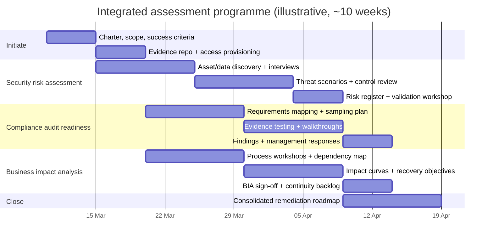

# Executing “Required Assessments” When Scope Is Unspecified

Status: Preserved imported research export

Interpretation

- Keep this file as a raw source artifact.
- Use [external_review_packet/received_reports/2026-03-10_report_01_intake.md](external_review_packet/received_reports/2026-03-10_report_01_intake.md) for the normalized operational reading.

```text

## Executive summary

When someone requests “required assessments” but does not specify assessment type, scope, industry, jurisdiction, or deliverables, the fastest reliable approach is to treat the request as an assurance-and-risk programme: (a) run a short scoping sprint to clarify the decision the assessments must support, (b) select a small, defensible set of assessments, and (c) execute them with standardised evidence handling, traceable criteria, and a consolidated findings register. This mirrors how risk management guidance emphasises context-setting and continuous communication over “one-size-fits-all” checklists. citeturn9view4turn12view0turn8view1

Sensible defaults (widely applicable across industries) are: a security risk assessment, a compliance audit (or “audit readiness” gap assessment), and a business impact analysis (BIA). These map cleanly to: managing cybersecurity risk across governance, identification and protection activities; verifying conformance to explicit requirements; and quantifying operational disruption impacts and recovery objectives. citeturn10view1turn11view0turn13view0turn8view2

Key outputs to expect—regardless of domain—should be decision-ready, not aspirational: (1) a prioritised risk register and treatment plan for security risks, (2) a requirements-to-evidence traceability pack for compliance gaps, and (3) an agreed set of critical processes, dependencies, and recovery targets (e.g., RTO/RPO) for resilience planning, with owners and timelines. citeturn12view0turn8view2turn13view0

A 6–12 week programme can run these three workstreams in parallel if you establish (early) a single evidence repository, a shared asset/service inventory baseline, and a unified “findings schema” (same fields, same severity logic, same remediation workflow). This reduces duplication and increases auditability of the final report set. citeturn12view0turn9view4turn10view1

## Baseline scoping approach for undefined “required assessments”

The main failure mode with “required assessments” is starting execution before agreeing what “required” means (regulatory mandate, investor/customer requirement, internal governance, incident-driven assurance) and what decision the assessments must enable (go/no-go launch, procurement approval, fundraising claims, certification, operational rollout). A tight scoping phase is therefore not a delay; it is the mechanism that makes the assessments defensible. citeturn9view4turn12view0

A minimal scoping sprint (typically 3–7 working days) should produce an **Assessment Charter** containing:

- **Decision to support** (e.g., ship, certify, sign contract, insure, deploy).
- **Objects in scope** (products, services, systems, sites, business processes).
- **Risk appetite / tolerance assumptions** (what “unacceptable” means, in plain terms). citeturn9view4turn8view0
- **Candidate frameworks/criteria** (named standards, regulations, contractual control sets).
- **Evidence boundaries** (what artefacts must exist vs will be created during assessment).
- **Deliverables** (reports, registers, evidence pack, executive readout).
- **Constraints** (timeline, data availability, stakeholder time, tooling access). citeturn12view0turn8view1

Two practical mechanisms make this work even with missing context:

1. **Profile-first framing (outcomes, not checklists).** The cybersecurity guidance behind CSF-style approaches stresses that outcomes should be scoped to organisational context and used to identify gaps and improvements; actions to achieve outcomes vary by organisation. That is exactly what you need when requirements are ambiguous. citeturn8view0turn10view1  
2. **Prepare → assess → communicate → maintain loop.** Risk assessment guidance explicitly treats “preparing for the assessment” (setting context) and “communicating results” as first-class steps, not afterthoughts. Use that structure as the backbone of your assessment programme. citeturn12view0turn11view0

To keep effort estimates meaningful without a budget/timeline, define effort bands upfront:

- **Low**: narrow scope (one system/process), strong existing documentation, limited stakeholder interviews.  
- **Medium**: multiple systems/processes, partial documentation, some testing/sampling.  
- **High**: enterprise-wide scope, weak documentation, significant testing, multi-team remediation planning.

This banding is consistent with standards’ emphasis on tailoring risk processes to context rather than prescribing a uniform method. citeturn9view4turn8view2

## Comparative catalogue of plausible assessment types

The table below lists common “required assessment” interpretations, what they are for, what they typically cover, and what you must be able to evidence.

| Assessment type | Purpose | Typical scope | Key frameworks / standards (examples) | Data / evidence required (typical) | Methods (typical) | Deliverables (typical) | Effort | Typical stakeholders |
|---|---|---|---|---|---|---|---|---|
| Security risk assessment | Identify and prioritise cybersecurity risks; decide treatments | Systems, apps, identities, data flows, suppliers, incident readiness | CSF-style outcomes; risk assessment guidance; ISMS risk approach; control catalogues | Asset/service inventory, architecture diagrams, access model, vulnerability info, incident history | Threat modelling + control review; risk scoring (likelihood/impact); gap analysis | Risk register, risk treatment plan, target profile / roadmap | Med–High | Exec sponsor, CIO/CISO, engineering, ops, legal/privacy, procurement |
| Compliance audit / attestation readiness | Determine conformance to explicit requirements; produce evidence trail | Selected standard/regulation/contract; defined boundary (entity, product, environment) | Audit programme guidance; chosen criteria (e.g., SOC 2 TSC, PCI DSS, ISO 27001) | Policies, procedures, control evidence (logs, tickets), training records, vendor evidence | Requirements mapping; sampling; walkthroughs; design vs operating effectiveness tests | Compliance gap register, evidence library, management action plan, audit-ready pack | Med–High | Compliance, audit, process owners, security, IT, finance, vendors |
| Business impact analysis (BIA) | Quantify disruption impacts; define recovery objectives (RTO/RPO) and dependencies | Critical processes/services; upstream/downstream dependencies | BCMS requirements + BIA guidelines | Process inventory, service catalogue, dependency maps, outage history, recovery capabilities | Workshops/interviews; impact modelling; criticality tiering | BIA report, critical processes list, RTO/RPO targets, dependency/BCP inputs | Medium | COO/ops, process owners, IT/service owners, finance, risk |
| Technical due diligence | Reduce technical uncertainty (architecture, maintainability, security posture, scalability) | Codebase, architecture, SDLC, infra, delivery capability | Architecture evaluation methods; software security maturity models; quality models | Repos, architecture docs, CI/CD, observability data, incident postmortems | Architecture review; code sampling; pipeline review; maturity scoring | Due diligence report, architecture risks, tech-debt register, integration plan | Med–High | CTO/engineering leadership, product, platform/SRE, security |
| ESG / sustainability assessment | Validate sustainability claims, metrics, and reporting readiness | Emissions inventory (Scopes), governance, policies, supplier data, reporting | Sustainability disclosure standards; reporting standards; emissions accounting standards | Activity data, supplier data, governance evidence, emissions factors/method notes | Materiality assessment; metric calculation + controls; assurance-style sampling | ESG baseline, emissions inventory, data controls, reporting-ready disclosures | Med–High | Finance, sustainability, ops, procurement, legal, exec |
| Accessibility & usability audit | Ensure products/services usable by people with disabilities; reduce legal/reputational risk | Websites/apps; core user journeys; documentation; support channels | WCAG; accessibility procurement standards; usability definitions | UI inventory, journeys, AT test results, user research, design system | Automated scans + manual testing; assistive tech checks; heuristic review | Accessibility conformance report, issue backlog, remediation guidance | Low–Medium | Product, design, engineering, QA, legal/compliance |
| Performance benchmarking | Validate responsiveness/throughput/stability objectives; prevent scale failures | APIs, critical flows, infra capacity, database, third-party dependencies | Software quality models; internal SLO/SLI standards | Monitoring baselines, load profiles, capacity limits, architecture | Load/stress tests; profiling; bottleneck analysis; capacity planning | Benchmark report, bottleneck list, tuning backlog, SLO recommendations | Low–Medium | SRE/platform, backend engineering, product, ops |
| Privacy impact assessment (DPIA-style) / privacy management assessment | Assess privacy risks to individuals; demonstrate privacy governance | Processing activities, data flows, vendors, retention, rights handling | DPIA obligations where high-risk processing; privacy management system guidance | Data inventory, processing records, lawful basis, vendor DPAs, security measures | Data-flow mapping; necessity/proportionality review; risk-to-rights assessment | DPIA report(s), risk controls, consultation triggers, privacy controls backlog | Low–Medium | DPO/privacy, legal, security, product, data owners |

Framework anchors for the above are well-established: cybersecurity outcomes and profiles (CSF 2.0) and risk assessment guidance (SP 800-30) for security risk assessment; ISMS standards and risk guidance (27001/27005/27002; 31000) for risk and control baselines; auditing guidance (19011, with a new 2026 draft revision in flight) for audit programmes; BCMS requirements and BIA guidelines (22301 and ISO/TS 22317) for resilience; SOC 2 Trust Services Criteria and PCI DSS for common third-party assurance targets; WCAG and EN 301 549 for accessibility; ISO/IEC 25010 for software quality/performance; IFRS S1, GRI Standards, the GHG Protocol Corporate Standard, and ISO 14064-1 for sustainability disclosures and emissions inventories; and DPIA triggers and expectations for high-risk processing. citeturn10view1turn12view0turn9view0turn14view0turn14view1turn9view4turn8view3turn26view0turn13view0turn8view2turn9view2turn9view3turn17view1turn17view2turn17view3turn17view4turn18view1turn18view0turn25view1turn24view0turn18view3

## Decision matrix for selecting assessments

Use this matrix as a fast selection tool when you only know (a) why you need assessments and (b) what constraints you face. Read it as: if the factor is high/urgent, prioritise the assessment types that remain effective under that constraint.

| Selection factor | If this is your reality | Prioritise | De-prioritise / defer |
|---|---|---|---|
| Objective: reduce cyber loss exposure | You handle sensitive data, operate online services, rely on vendors, or recently changed architecture | Security risk assessment; targeted technical due diligence | “Pure” performance benchmarking (unless availability is the dominant risk) |
| Objective: pass procurement / customer assurance | Customers ask for SOC 2 / ISO 27001 / PCI-style evidence or control mappings | Compliance audit/readiness (plus security risk assessment to drive fixes) | Broad ESG work (unless buyer mandates it) |
| Objective: resilience / continuity | Outages have high financial/safety impact; you need clear recovery targets | BIA first (feeds continuity plans); then security risk assessment for incident-driven disruption | Standalone accessibility audit (unless legally required) |
| Regulatory exposure: high / multi-jurisdiction | You operate in regulated sectors or across multiple regions; legal risk is material | Compliance audit + DPIA-style privacy assessment where relevant | Unbounded technical due diligence (keep it tied to requirements) |
| Budget: constrained | You need maximum risk reduction per unit effort | Security risk assessment with tight scope + CIS-style “top controls” focus; WCAG scan for quick wins | ESG reporting readiness (unless externally mandated) |
| Timeline: very short (≤4–6 weeks) | You need an answer fast for a transaction or launch | Rapid compliance gap assessment; “thin-slice” BIA for top services; security triage | Deep architecture evaluation workshops across many domains |
| Data availability: low / docs missing | You lack diagrams, inventories, control evidence, or logs | Start with discovery: asset & process inventory + interviews; BIA workshops often work even with weak tooling | Evidence-heavy audits that require historical operating effectiveness proof |
| Data availability: high / strong telemetry and tickets | You have mature ops tooling, change logs, and documented controls | Deeper testing: operating effectiveness sampling; performance benchmarking; maturity scoring | None inherently—this is the ideal condition |

Why these defaults are robust: security risk work and continuity/BIA are strongly “context-driven” and can start with structured discovery; compliance audits are requirement-driven and become efficient once you know which requirements matter and can assemble evidence in an auditable way. citeturn12view0turn13view0turn8view2turn22view1turn8view3

A simple rule for the common “unknown unknowns” situation:

- If you cannot name the requirement you must satisfy: run **security risk assessment + BIA** first, then choose the compliance target after you uncover data types, customer demands, and operational criticalities. citeturn9view4turn10view1turn8view2  
- If you can name the requirement (e.g., “SOC 2 Type II”, “PCI DSS”): run **compliance readiness** immediately, but keep a small security risk thread running in parallel to prevent “paper compliance” missing high-impact cyber risks. citeturn9view2turn9view3turn12view0

## Security risk assessment execution plan

A security risk assessment should deliver a prioritised, owner-assigned risk register and an actionable risk treatment plan aligned to an organisation’s risk strategy and stakeholder expectations. CSF 2.0 explicitly frames cybersecurity in terms of outcomes across GOVERN, IDENTIFY, PROTECT, DETECT, RESPOND, RECOVER, with GOVERN informing the other functions. citeturn10view1turn8view0

**Execution structure (risk assessment lifecycle).** The risk assessment process can be structured as: prepare for the assessment, conduct the assessment (threats/vulnerabilities/likelihood/impact → risk), communicate results, and maintain the assessment over time. citeturn12view0turn11view0

**Data collection checklist (practical minimum).** Collecting *perfect* evidence is rarely possible at the start; the goal is enough truth to make prioritised decisions.

| Evidence category | Minimum artefacts to request / build |
|---|---|
| Organisational context | Mission/service description, key stakeholders, “crown jewels”, high-level risk appetite/tolerance notes citeturn9view4turn10view1 |
| Asset & service inventory | System list, data classifications, integration map, key third parties/suppliers citeturn10view1turn14view0 |
| Architecture & trust boundaries | Current diagrams (even rough), network zones, identity boundaries, secrets/key management approach citeturn14view1turn10view3 |
| Identity & access | AuthN/AuthZ mechanisms, privileged accounts list, joiner/mover/leaver workflows citeturn14view1turn10view3 |
| Vulnerability & exposure inputs | Recent scan outputs, patching SLAs, SBOM (if available), external attack surface inventory citeturn12view0turn22view2 |
| Detection/response readiness | Logging coverage, alerting routes, incident runbooks, past incident summaries citeturn10view1turn14view1 |
| Supplier and supply chain | Critical vendors, data sharing, security clauses, breach notification terms citeturn10view1turn14view0 |

**Analysis methods (rigorous but pragmatic).** Use a combination approach:

- **Outcome-based gap analysis** (against a target CSF-style profile) to keep the assessment decision-oriented rather than control-by-control. citeturn8view0turn10view1  
- **Threat–vulnerability–likelihood–impact reasoning** to generate risk statements that are comparable and prioritised. citeturn12view0  
- **Control mapping** to a recognised catalogue where suitable (e.g., ISO/IEC 27002 guidance controls; CIS Controls for practical prioritisation; OWASP Top 10 for app-layer focus). citeturn14view1turn22view1turn22view2  
- **Quantitative option (when needed):** if decision-makers require loss magnitude estimates, consider standards-based quantitative risk analysis methods referenced by credible public-sector compendia (noting that some Open FAIR materials require authenticated access). citeturn21view0

**Findings template (risk register entry).** Use a consistent schema so risks can be audited and tracked. This template is intentionally “evidence-first”:

| Field | Example / guidance |
|---|---|
| Risk ID | SEC-RA-### |
| Risk statement | “If **[threat event]** exploits **[vulnerability/predisposing condition]**, then **[impact to CIA/operations]** may occur.” citeturn12view0 |
| Scope object | System/service/process/vendor |
| Evidence | Logs/screenshots/tickets/interviews + dates |
| Likelihood | Qualitative scale with definition (e.g., 1–5) |
| Impact | Financial/operational/legal/safety dimensions |
| Inherent risk rating | From likelihood × impact |
| Existing controls | Named controls + observed status |
| Residual risk | Post-control estimate |
| Recommended treatment | Avoid / mitigate / transfer / accept (with rationale) citeturn9view4turn12view0 |
| Owner & due date | Accountable person, target date |
| Traceability tags | CSF function/category; ISO control reference where used citeturn10view1turn14view1 |

**Remediation prioritisation approach (practical).** Prioritise fixes using a blended model:

1. **Non-negotiables first:** items that create unacceptable risk relative to stated tolerance (or contractual/regulatory obligations). citeturn9view4turn10view0  
2. **Exploitability + blast radius:** externally reachable and high-impact pathways outrank internal, low-impact issues.  
3. **Control leverage:** prioritise changes that reduce risk across multiple services (identity hardening, patching automation, logging coverage). citeturn22view1turn14view1  
4. **Time-to-risk-reduction:** classify actions into “rapid containment” (days), “control uplift” (weeks), and “architectural change” (months).  

**Illustrative timeline and resourcing (8 weeks).** This is a worked example; adjust after scoping.

| Weeks | Work | Core roles (typical) | Output |
|---|---|---|---|
| 1 | Charter, scope, define scales, set evidence repo | Assessment lead + security lead + system owners | Assessment plan + interview schedule citeturn12view0turn8view0 |
| 2–3 | Asset/data discovery; initial threat scenarios | Security analyst + architects + ops | Draft inventory + top risk hypotheses citeturn10view1turn12view0 |
| 4–5 | Control review + targeted testing (where allowed) | Security + engineering/SRE | Evidence-backed risk statements citeturn14view1turn22view2 |
| 6 | Risk scoring; treatment options; cost/effort notes | Lead + SMEs | Prioritised risk register citeturn12view0turn9view4 |
| 7 | Stakeholder validation workshop | Exec sponsor + owners | Agreed priorities + owners |
| 8 | Final report + remediation roadmap | Lead | Final package + rollout plan |

## Compliance audit execution plan

A compliance audit (or readiness assessment) answers a different question than a risk assessment: not “what could go wrong?”, but “do we meet requirement X, and can we prove it?”. Audit programme guidance emphasises consistent audit principles, programme management, and competence of auditors/audit teams. citeturn8view3turn26view0

Because auditing standards evolve, treat audit guidance as versioned: ISO indicates that ISO/FDIS 19011 (Edition 4, 2026) is under development and intended to replace ISO 19011:2018. In practice, you should check the latest published edition before finalising your audit method. citeturn26view0turn8view3

**Step sequence (readiness model).**

1. **Define the compliance target(s).** Examples of widely requested targets include SOC 2 (Trust Services Criteria) and PCI DSS for payment environments. citeturn9view2turn9view3  
2. **Establish audit boundaries.** “What is in scope?” must be explicit: which products, environments, legal entities, and vendors are included.  
3. **Create a requirements-to-control mapping.** Map each requirement to control statements and evidence expectations.  
4. **Test design and (where relevant) operating effectiveness.** For assurance-type reports, evidence must show controls exist and operate as described over a period. citeturn1search0turn9view2  
5. **Issue findings with requirement traceability and agree management responses.**  

**Data collection checklist (evidence pack).**

| Evidence bucket | Typical contents |
|---|---|
| Governance | Policies, roles/ownership, risk/compliance committee minutes |
| HR & access | Training completion, onboarding/offboarding evidence, access reviews |
| Change & SDLC | Change tickets, approvals, deployment logs, peer review evidence |
| Operations | Monitoring dashboards, incident tickets, postmortems, problem management |
| Security controls | MFA configuration, vulnerability management records, encryption configs |
| Vendor management | Due diligence, contracts, subprocessor lists, SLA and breach clauses |
| Physical (if applicable) | Data centre controls, visitor logs, device handling procedures |

This aligns with common assurance criteria sets: SOC 2 criteria cover security, availability, processing integrity, confidentiality, and privacy; PCI DSS is a baseline of technical/operational requirements to protect payment account data. citeturn9view2turn9view3turn9view1

**Findings template (audit gap / nonconformity).**

| Field | Guidance |
|---|---|
| Finding ID | COMP-### |
| Requirement reference | Clause/control ID (e.g., SOC 2 CC#, PCI Req #, ISO clause) |
| Finding statement | Condition vs criterion vs cause (brief, factual) |
| Evidence | Exact artefacts + timestamps |
| Impact | Risk to compliance, customers, operations |
| Severity | High/Med/Low (define) |
| Recommendation | Specific corrective action |
| Management response | Owner, target date, remediation approach |
| Retest criteria | What proof closes the finding |

**Remediation prioritisation approach (compliance).**

- **Must-fix for audit pass:** gaps that fail mandatory criteria or prevent an auditor from obtaining sufficient evidence.  
- **Prioritise evidence-generating controls:** where controls exist but are undocumented, build repeatable evidence trails (tickets/log exports/attestations) early.  
- **Bundle by control family:** reduce overhead by remediating root causes (e.g., standardised change control evidence, central access review cadence).  

This is consistent with the reality that many standards are “management system” in nature: they require not only controls but a system to maintain and improve them. citeturn9view0turn8view3

**Illustrative timeline and resourcing (10 weeks, readiness + remediation planning).**

| Weeks | Work | Roles | Output |
|---|---|---|---|
| 1–2 | Target selection, boundaries, mapping | Compliance lead + SMEs | Control matrix + evidence request list citeturn8view3turn9view2 |
| 3–5 | Evidence collection, walkthroughs | Process owners + auditor/assessor | Draft gaps with citations |
| 6–7 | Sampling/testing, consistency checks | Assessor + ops/security | Confirmed findings register citeturn9view3turn9view2 |
| 8 | Management responses, remediation plan | Owners + leadership | Action plan + retest plan |
| 9–10 | Executive report + audit-ready pack | Lead | “Audit binder” + exec summary |

## Business impact analysis execution plan

A BIA determines which processes and services are critical, what the impacts of disruption are over time, and what recovery objectives should be. ISO/TS 22317 is explicit that it provides guidelines for a formal, documented BIA process appropriate to an organisation’s needs and that it does not prescribe a uniform process. citeturn8view2

As the management system wrapper, ISO 22301 frames business continuity as a documented system to protect against, reduce likelihood of, and recover from disruptive incidents. This makes BIA outputs directly decision-relevant (they become requirements for continuity strategies and capabilities). citeturn13view0

**Data collection checklist (BIA essentials).**

| Input | What “good” looks like |
|---|---|
| Process inventory | Named processes/services with owners and customers |
| Dependency map | Apps, data stores, vendors, facilities, key people per process |
| Impact categories | Financial, legal/regulatory, reputation, customer harm, safety (as relevant) |
| Time-based impact curve | How impact grows at 2h/8h/24h/72h/1w etc |
| Current recovery capability | Backups, failover, manual workarounds, staffing constraints |
| Interdependencies | Upstream/downstream process coupling (who blocks whom) |

**Analysis methods.**

- **Structured workshops/interviews** with process owners to elicit impacts, tolerances, and workarounds (often the only viable method when documentation is weak). citeturn8view2turn13view0  
- **Tiering model** to classify processes/services into criticality levels that map to recovery strategies.  
- **Objective setting**: define recovery targets (RTO/RPO) and minimum service levels for each tier. (Exact terminology varies by organisation; the principle is consistent.)  
- **Cross-validation** with technical owners to ensure targets are feasible and to surface capability gaps.

**Findings template (BIA gap / continuity requirement).**

| Field | Guidance |
|---|---|
| BIA item ID | BIA-### |
| Process/service | Name + owner |
| Impact summary | Dominant impact categories and when they become severe |
| Criticality tier | Tier 0–3 (define) |
| Recovery objectives | Target RTO/RPO (or equivalents) + rationale |
| Key dependencies | Systems, vendors, facilities, roles |
| Current capability | What exists today |
| Gap | Where capability fails objectives |
| Recommendation | Continuity strategy options + required enablers |
| Owner & timeline | Accountable owner, target dates |

**Prioritisation approach (resilience backlog).**

- **Start from “time-to-unacceptable impact”.** The shorter the time window, the higher the priority.  
- **Exploit high-leverage enablers:** improvements that help multiple critical services (identity recovery, backup integrity checks, runbook quality, vendor failover).  
- **Align to governance:** ISO-style management system approaches stress embedded monitoring and continual improvement, so prioritise actions that create repeatable continuity discipline (scheduled tests, metrics, ownership). citeturn13view0turn9view4

**Illustrative timeline and resourcing (6–8 weeks).**

| Weeks | Work | Roles | Output |
|---|---|---|---|
| 1 | Scoping + taxonomy (process list, tiers, impact scales) | BCM lead + ops + finance | BIA workbook template + schedule citeturn8view2turn13view0 |
| 2–4 | Workshops + dependency mapping | Process owners + IT/service owners | Draft BIA entries |
| 5 | Consolidation + conflict resolution (targets vs feasibility) | Lead + SMEs | Near-final BIA register |
| 6 | Executive validation + sign-off | Exec sponsor | Approved recovery targets |
| 7–8 (optional) | Continuity roadmap production | Lead + owners | Gap remediation backlog & programme inputs |

## Primary sources, suggested tools, and programme visuals

**Recommended primary/official sources (high-signal starting set).** The following organisations and documents are appropriate anchors when jurisdiction and industry are unknown:

- entity["organization","National Institute of Standards and Technology","us standards body"]: CSF 2.0 (core functions and outcome structure) and SP 800-30 (risk assessment guidance); optionally SP 800-53 (control catalogue with a documented minor update release in 2025). citeturn10view1turn12view0turn23view0  
- entity["organization","International Organization for Standardization","standards body"] and entity["organization","International Electrotechnical Commission","standards body"]: ISO/IEC 27001 (ISMS requirements), ISO/IEC 27005 (information security risk management cycle), ISO/IEC 27002 (control guidance), ISO 31000 (risk management guidelines), ISO 22301 + ISO/TS 22317 (BCMS and BIA), ISO/IEC 27701 (privacy management extension), and (for ESG) ISO 14001 and ISO 14064-1. citeturn9view0turn14view0turn14view1turn9view4turn13view0turn8view2turn18view4turn25view0turn25view1  
- entity["organization","American Institute of Certified Public Accountants","soc reports"]: Trust Services Criteria underpinning SOC 2 examinations. citeturn9view2turn1search0  
- entity["organization","PCI Security Standards Council","payment security standards"]: PCI DSS baseline requirements to protect payment account data. citeturn9view3  
- entity["organization","World Wide Web Consortium","web standards body"]: WCAG 2.2 recommendation text and supporting guidance. citeturn17view1  
- entity["organization","European Telecommunications Standards Institute","accessibility standardisation"]: EN 301 549 overview (useful as a procurement-style accessibility requirements model even if you are outside Europe). citeturn17view2  
- entity["organization","IFRS Foundation","sustainability disclosure standards"]: IFRS S1 (general sustainability-related disclosures) and IFRS S2 (climate-related disclosures; closely aligned to TCFD concepts). citeturn17view4turn4search5  
- entity["organization","Global Reporting Initiative","sustainability reporting standards"]: GRI Standards (impact-focused sustainability reporting). citeturn18view1  
- For emissions accounting: the GHG Protocol Corporate Standard (requirements and guidance for corporate-level GHG inventories). citeturn18view0  
- entity["organization","Center for Internet Security","security controls v8"]: CIS Controls v8 (prioritised safeguards, practical implementation focus). citeturn22view1  
- entity["organization","OWASP","application security org"]: OWASP Top 10 (now listing the 2025 edition as current) and OWASP SAMM (software assurance maturity). citeturn22view2turn22view0  
- entity["organization","Software Engineering Institute","sei cmu"]: ATAM resources for evaluating architectures against quality attributes, including notes on typical evaluation duration. citeturn18view3  
- For quantitative risk analysis methods: ENISA’s compendium-style work can be a credible pointer to “what exists” across ecosystems, including references to Open Group risk analysis standards (not always publicly accessible without authentication). citeturn21view0  
- For DPIA triggers and expectations (example jurisdiction): the entity["organization","European Commission","eu executive body"] summarises when DPIAs are required (high-risk processing), and emphasises DPIA as a living tool rather than one-off paperwork. citeturn24view0  

**Suggested tools (by assessment type).** Tooling should support evidence integrity, repeatability, and traceability:

- Security risk assessment: asset inventory + CMDB/service catalogue; vulnerability scanning; cloud posture management; IAM review tools; threat modelling tools; log/SIEM access; GRC/risk register management. (Pick tools that can export evidence and timestamps.) citeturn12view0turn22view1turn10view1  
- Compliance audit/readiness: audit management (control matrix, sampling plan); evidence repository with immutable logging; ticketing integration; policy management/versioning; automated control monitoring where feasible. citeturn8view3turn23view0  
- BIA: structured workshop templates; dependency mapping tooling; continuity planning tools; scenario/test schedule tracking. citeturn8view2turn13view0  
- Accessibility: automated WCAG scanners plus manual assistive-technology testing workflows; conformance reporting templates aligned to requirements. citeturn17view1turn17view2  
- Performance benchmarking: load-testing harnesses, profiling tools, observability stack (metrics/logs/traces), SLO dashboards. citeturn17view3  
- ESG: ESG data management; emissions calculation workbooks; change logs for methodology; evidence pack for assurance. citeturn18view0turn17view4turn25view1  

**Mermaid timeline (illustrative 10-week integrated programme).** Dates use the current reference date (2026-03-10) as an example start.



This structure reflects standards’ shared emphasis on (1) early context-setting, (2) evidence-driven assessment, and (3) explicit communication and maintenance rather than one-off “box ticking.” citeturn12view0turn8view0turn8view3turn8view2  

**Mermaid flowchart (assessment decision process).**

```mermaid
flowchart TD
  A[Start: "Required assessments" requested, scope unknown] --> B[Scoping sprint: decision, objects, constraints, stakeholders]
  B --> C{Can you name a required standard/regulation or customer requirement?}
  C -- Yes --> D[Run compliance readiness audit against named criteria]
  D --> E{Is cyber loss exposure material or poorly understood?}
  E -- Yes --> F[Run security risk assessment in parallel]
  E -- No --> G[Proceed with compliance remediation + evidence pack]
  C -- No --> H{Is service disruption impact a top risk?}
  H -- Yes --> I[Run BIA to set recovery objectives + dependencies]
  H -- No --> J{Is user access/inclusion legally or commercially critical?}
  J -- Yes --> K[Run accessibility & usability audit]
  J -- No --> L[Start with security risk assessment (thin-slice) to surface drivers]
  F --> M[Consolidate findings into unified register + roadmap]
  I --> M
  K --> M
  L --> M
  G --> M
  M --> N[End: prioritised plan, owners, timelines, evidence trail]
```

This decision logic is consistent with how risk and management-system standards repeatedly foreground context, stakeholder expectations, and proportionality/tailoring. citeturn9view4turn8view0turn12view0turn8view2
```